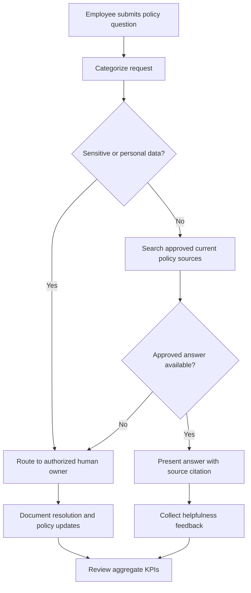

# Diagram Source (Mermaid)
**Portfolio simulation.** Render in GitHub-compatible Mermaid viewer.

```mermaid
flowchart TD
  A[Employee submits policy question] --> B[Categorize request]
  B --> C{Sensitive or personal data?}
  C -->|Yes| D[Route to authorized human owner]
  C -->|No| E[Search approved current policy sources]
  E --> F{Approved answer available?}
  F -->|No| D
  F -->|Yes| G[Present answer with source citation]
  G --> H[Collect helpfulness feedback]
  D --> I[Document resolution and policy updates]
  H --> J[Review aggregate KPIs]
  I --> J
```
